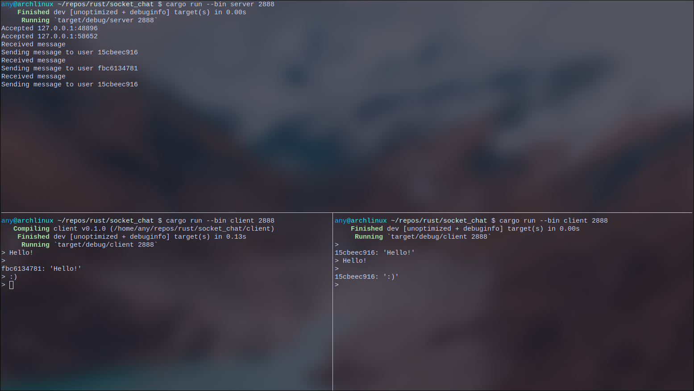

# Socket Chat Room
* A simple chat room written in Rust. The goal of this project is to learn how to use Rust's `std::net` library to create a simple chat room.

## Features
* Multiple clients can connect to the server.
* Messages are broadcasted to all other clients.
* Clients are provided with a unique ID.

## Pre-requisites
* Rust
* Cargo

## How to run
1. Clone the repository
2. Run the server
```bash
cargo run --bin server port username_length
```
3. Start a client
```bash
cargo run --bin client port
```



